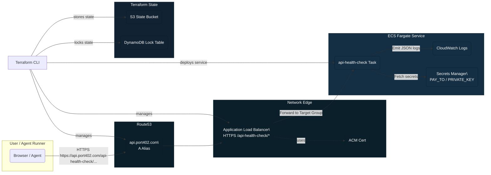

## api-health-check

api-health-check is a Lucid Agent that repeatedly probes an HTTP(S) endpoint and reports whether it is healthy. Each run sends up to four requests (HEAD with a GET fallback) spaced 250 ms apart, tracks the slowest latency, and can dispatch a webhook when any attempt fails.

### Quick start

```sh
bun install
bun run dev
```

### Available scripts

- `bun run dev` – start the agent in watch mode.
- `bun run start` – start the agent once.
- `bunx tsc --noEmit` – type-check the project.

### Container workflow

Build and run locally with Docker:

```sh
docker build -t api-health-check .
docker run --env-file .env.development -p 8787:8787 api-health-check

# or use the helper script (defaults to .env.development)
./scripts/run_local.sh [.env.production]
```

Build and upload new image to ECR, then add that image arn in the terraform vars
```sh
bash ./scripts/build_and_push_ecr.sh --repo api-health-check --tag test --region us-west-2 --account 477505023261
```
Point `--env-file` at whichever config you want to test (development, staging, production) before deploying to AWS.


### Deployment to AWS

```sh
terraform plan -var-file=envs/dev.tfvars
terraform apply -var-file=envs/dev.tfvars
```

### What the agent does

- Accepts a URL, expected status, latency budget, and optional alert webhook.
- Fires four probes (HEAD first, GET fallback) with 250 ms spacing.
- Declares the endpoint healthy only if every attempt returns the expected status within the latency budget.
- Returns the slowest latency observed and the failure reason (if any).
- Optionally sends an alert webhook payload containing the run diagnostics.
- Supports paid alert dispatching when billing env vars are supplied.

### Infrastructure

Terraform configs under `terraform/` provision the public networking stack, ECS Fargate service, HTTPS-enabled Application Load Balancer with `/api-health-check` routing, ACM certificate, and Route 53 DNS required to expose the agent at `port402.com/api-health-check`.

### Architecture



### Deploying a new version

`npm version <patch|minor|major>` then build/push the container image referenced in `terraform/envs/*.tfvars` before running `terraform apply` for the desired environment.
